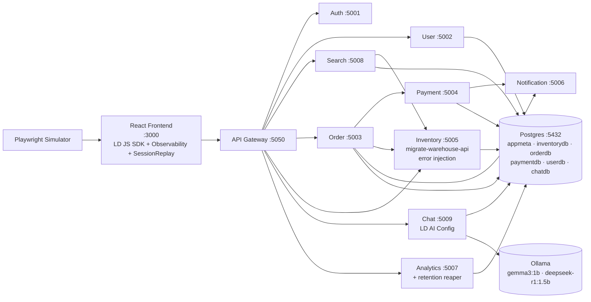
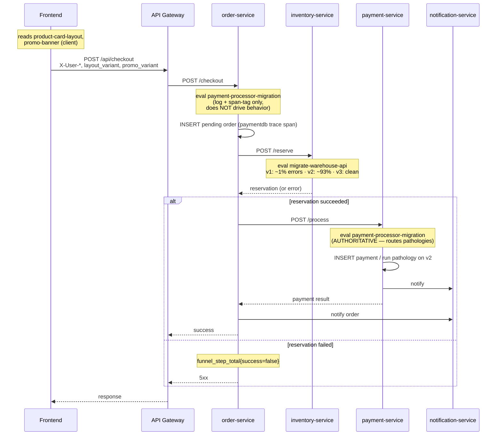
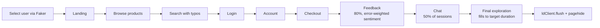

# AGENTS.md — Agent-Oriented Context

Exhaustive context for coding agents (Claude, Cursor, etc.) extending this repo. Humans reading: this is deliberately dense — skim the ToC and jump.

## Project purpose + constraint

This is a **proof-of-concept demo populator**, not a production codebase. The goal is to emit opinionated, realistic LaunchDarkly signals (traces, session replay, flag evaluations, AI Config telemetry, guarded-rollout data, funnel metrics, feedback) so SEs and engineers have a live environment to demo or prototype against.

**Iterate toward showing off LD features, not production hardening.** Add realism, add flag-driven behaviors, add signals — don't spend budget on retry policies, auth hardening, schema migrations, or test coverage unless it's required to make the demo surface function.

## LaunchDarkly project

- **Project key:** supplied by the contributor — there is no shared default. The maintainer uses `tt-qr-demo`; set yours via `TF_VAR_project_key`, a `terraform.tfvars`, or your own `.env`. The Terraform config in `terraform/` requires it explicitly.
- **Environments:** the demo reads `ENVIRONMENT` from `.env` (defaulting to `production` in `docker-compose.yml`). Create at least one matching environment in your project (Terraform expects `staging`, `test`, `production` to exist for per-env resource references — override `environment_keys` in `provider.tf` if yours differ).
- **SDK keys:** server-side `LD_SDK_KEY` and client-side `VITE_LD_CLIENT_SIDE_ID` are your-account values, always `.env`-driven. Never commit them.
- All flags below must exist in the target project. Provision via `terraform/` or the LD UI.

## Service topology

The traffic simulator's internal architecture (scenario engine, phases, human behaviors, sequence diagrams) is documented separately in [`agents/simulator-diagram.md`](./agents/simulator-diagram.md) — use that as the authoritative source when touching simulator code.

## Flags

All flags live in the target LD project (contributor-supplied — see above).

| Key | Kind | Variations | Where evaluated | What it gates (user-visible effect) |
|---|---|---|---|---|
| `migrate-warehouse-api` | multivariate string (client + server eval) | `v1` / `v2` / `v3` | Server: `backend/services/inventory-service/app.py:151` (`get_warehouse_api_version`). Client: evaluated on mount in `frontend/src/App.jsx:18` to generate feature events. | Controls warehouse error injection. v1 = ~1% baseline. v2 = ~93% composite error rate (TimeoutError, ParseError, RateLimit, StaleCache, Auth failures). v3 = clean. Every injected error calls `record_exception` + `record_log` + increments `app.inventory.warehouse_error_total`. |
| `payment-processor-migration` | multivariate string (server only) | `v1` / `v2` / `v3` | `backend/services/payment-service/app.py:135` (`get_processor_version`) **and** `backend/services/order-service/app.py` in `/checkout` (evaluated up front on every attempt, logged + span-tagged only, not behavior-driving). | Payment-service routes DB pathologies when v2: slow_query (30%, pg_sleep), seq_scan_regression (20%), pool_hold (10%), rollback (8%). v1/v3 take the clean path. Order-service evaluates it for guarded-rollout sample volume — behavior remains authoritative in payment-service. |
| `session-replay-privacy` | multivariate string (client) | `none` / `default` / `strict` | `frontend/src/main.jsx:40` — fetched via LD's clientsdk evalx endpoint BEFORE SDK init (SessionReplay's `privacySetting` can only be set in the constructor). | Session Replay recording privacy level. Falls back to `none` if the pre-init fetch fails. |
| `product-card-layout` | multivariate string (client) | `standard` / `minimal` / `detailed` | `frontend/src/pages/Products.jsx:15`, `frontend/src/pages/Checkout.jsx:20`, `frontend/src/components/products/ProductCard.jsx:20` | Product card UI variant. `standard` = control (image/name/price/CTA). `minimal` = image + name only, price on hover. `detailed` = adds rating, stock urgency, free-shipping badge. Tagged as `layout_variant` on every funnel metric. |
| `promo-banner` | multivariate string (client) | `none` / `free-shipping-50` / `percent-off` / `urgency` | `frontend/src/components/layout/PromoBanner.jsx:17`, `frontend/src/pages/Checkout.jsx:21` | Site-wide banner. `urgency` includes a cosmetic countdown timer. Tagged as `promo_variant` on checkout metrics. |

**AI Config:** `support-chatbot` (key) — used in `backend/services/chat-service/app.py:325` via `ai_client.completion_config('support-chatbot', context, DEFAULT_AI_CONFIG, {})`. Variations select model name + system prompt + hyperparameters (temperature, top_p, top_k, max_tokens). The chat-service maps LD's OpenAI-style parameter names to Ollama's native names (see `LD_TO_OLLAMA_PARAMS` in the same file). Supported models in-repo: `gemma3:1b`, `deepseek-r1:1.5b` (the latter's `<think>...</think>` reasoning is stripped before returning).

## Context model (server-side multi-context)

Every server-side flag evaluation builds a **multi-context** with up to three kinds:

- `user` — end-user identity from the browser, carried in `X-User-*` request headers (`X-User-Key`, `-Name`, `-Email`, `-Plan`, `-Role`, `-Metro`, `-Country`).
- `request` — ephemeral anonymous context (UUID key) with `endpoint`, `method`, `timestamp`.
- `service` — stable service identity, key = service name.

The canonical `_build_user_context()` function is duplicated across services that evaluate flags:
- `backend/services/inventory-service/app.py:87` (original)
- `backend/services/payment-service/app.py:97`
- `backend/services/order-service/app.py:122`

Header extraction is also done in non-flag-evaluating services (api-gateway, chat-service) via `_user_from_headers()` for user hydration from `USER_HEADERS`.

Frontend sends these headers on every API call via `frontend/src/services/api.js`. The simulator injects `window.__LD_USER__` at page init (see `simulator/traffic_generator.py`) and the frontend's `main.jsx` feeds those attrs into `asyncWithLDProvider`'s initial context so the first flag eval already carries the full user.

## Simulator architecture

Authoritative doc: [`agents/simulator-diagram.md`](./agents/simulator-diagram.md) (has detailed mermaid diagrams of phases, class relationships, and sequence flow).

Headlines:

- **Three Playwright engines** — chromium, firefox, webkit — with weighted device/UA profiles (see `BROWSER_PROFILES` at `simulator/traffic_generator.py:78`). Mobile entries use Playwright device presets (iPhone 13, Pixel 7); desktop entries override UA because headless Chromium's UA trips LD's bot filter.
- **Session phases** (9): landing → browse → search → login → account → checkout → feedback → chat (50% of sessions) → final exploration. Each phase is designed to hit specific API endpoints so every session produces a full trace family.
- **HumanTypist / HumanClicker** — variable WPM, typos with backspace corrections, pre-click hesitation, idle interactions (mouse drift + scrolls) that produce rich rrweb events for Session Replay.
- **Feedback sentiment weighting** — `_phase_feedback` counts 5xx responses the session saw and skews the positive/neutral/negative pick accordingly. When errors occurred, 70% of feedback is biased to target `migrate-warehouse-api` so feedback correlates with the flag state that caused them.
- **Session keys and events** are logged to `/app/logs/session_keys.log` and `/app/logs/ld_events.log` on the simulator container — cross-reference with LD dashboards to find specific simulated users.

## Observability surface

**LD Observability plugin** is installed on both sides:
- Frontend: `@launchdarkly/observability` via the JS SDK plugin API (`frontend/src/main.jsx:79`), with `networkRecording.recordHeadersAndBody = true`.
- Backend: `ldobserve.ObservabilityPlugin` wired into every service via `shared/observability.py:create_ld_client`.

**Signals emitted** (full inventory: [`SIGNALS.md`](./SIGNALS.md)):
- Traces: OTel spans via `start_span`, W3C `traceparent`/`tracestate` propagated through `get_trace_headers()` in every service. SQLAlchemy auto-instrumented; LLM calls auto-instrumented via OpenLLMetry's `OllamaInstrumentor`.
- Metrics: frontend `LDObserve.recordCount`/`recordHistogram`, backend `record_count`/`record_histogram` from `ldobserve.observe`. All funnel metrics carry `layout_variant` and/or `promo_variant`.
- Logs: `record_log` (backend) and `LDObserve.recordLog` (frontend). Structured with service, endpoint, method, user, flag values.
- Errors: `record_exception` (backend), `LDObserve.recordError` + `ErrorBoundary` (frontend).
- Session Replay: `@launchdarkly/session-replay` (client-only), `inlineStylesheet: true`, privacy driven by `session-replay-privacy`. `sessionSecureID` attached to feedback events as `o11y_session_id` to jump from feedback → replay.
- AI Config monitoring: `tracker.track_tokens / track_duration / track_time_to_first_token / track_feedback` in `chat-service/app.py`, with trackers cached by `generation_id` (LRU 500) so delayed thumbs feedback routes to the correct variation.

## Docker + compose layout

**Services and ports** (all on the `ld-observability` bridge network):

| Service | Container port | Host port | DB |
|---|---|---|---|
| postgres | 5432 | `127.0.0.1:5432` (loopback only) | `appmeta` + per-service DBs |
| api-gateway | 5000 | 5050 | — |
| auth-service | 5001 | 5001 | — |
| user-service | 5002 | 5002 | `userdb` |
| order-service | 5003 | 5003 | `orderdb` |
| payment-service | 5004 | 5004 | `paymentdb` (pool size tunable via env) |
| inventory-service | 5005 | 5005 | `inventorydb` |
| notification-service | 5006 | 5006 | — |
| analytics-service | 5007 | 5007 | (default `paymentdb`, reaper opens per-DB dynamically) |
| search-service | 5008 | 5008 | `inventorydb` (cross-service read — deliberate, to produce visible cross-service DB spans) |
| chat-service | 5009 | 5009 | `chatdb` |
| frontend | 80 | 3000 | — |
| simulator | — | — (no ports) | — |
| ollama (profile: `local-models`) | 11434 | 11434 | — |

**Postgres** is ephemeral by design — no volume mount, so every `docker compose up` re-runs `postgres/initdb/01-databases.sql` through `06-chatdb.sql` and every team member starts from identical seed data. Healthcheck uses `pg_isready -U app -d appmeta` (the explicit `-d appmeta` matters — `pg_isready` defaults the DB name to the username, which doesn't exist here, and the default would spam `database "app" does not exist`).

**LLM modes** (see `.env.example` for the full matrix):
1. `CHAT_ENABLED=false` — chat returns maintenance message, no Ollama needed.
2. `CHAT_ENABLED=true` + `--profile local-models` — Docker Ollama container, CPU-only on Mac.
3. `CHAT_ENABLED=true` + `OLLAMA_URL=http://host.docker.internal:11434` — native Ollama (GPU-accelerated on Mac).

The `ollama-pull` one-shot container pulls `gemma3:1b` and `deepseek-r1:1.5b` and warms them with a dummy prompt so first requests aren't cold.

## Checkout flow with flag evaluations

## Simulator phase flow

Abbreviated — full detail in `agents/simulator-diagram.md`.

## Common pitfalls / recent bugs fixed

- **Playwright version pinning.** `simulator/requirements.txt` has `playwright==1.58.0` and `simulator/Dockerfile` has `FROM mcr.microsoft.com/playwright/python:v1.58.0-jammy`. These MUST match. Mismatch surfaces as missing system libs (e.g. `libgtk-4-1` for WebKit) and the container crash-loops.
- **`SERVICE_VERSION` drift.** Single source of truth is `SERVICE_VERSION` in `.env`. Docker compose references `${SERVICE_VERSION:-X.Y.Z}` defaults per service; frontend gets it via build arg `VITE_SERVICE_VERSION`. Bumping `.env` alone doesn't rebuild the frontend — run `docker compose up -d --build frontend` after bumps. Never hardcode a version in a service's compose entry; it will silently drift from backend metrics.
- **Postgres healthcheck DB name.** `pg_isready` defaults DB name to the username. Since `POSTGRES_USER=app` and there's no `app` DB, the healthcheck must pass `-d appmeta` or it'll succeed but spam `FATAL: database "app" does not exist` every interval. See `docker-compose.yml:26`.
- **LD SDK init ordering.** `create_ld_client()` MUST run before `setup_flask_instrumentation()` (tracer provider setup happens inside the LD Observability plugin; Flask/requests instrumentation needs that provider to exist). Also: W3C propagator is set inside `setup_flask_instrumentation`, not at module import, because the LD plugin would overwrite it.
- **SessionReplay privacy is constructor-only.** Changing `session-replay-privacy` flag has no effect mid-session — the value is read via a pre-init clientsdk fetch in `main.jsx` and passed to the SessionReplay constructor. Changing the flag only takes effect on the next page load.
- **`X-User-*` headers are the source of truth for user identity across services.** If you add a new field to the user context, thread it through: simulator → `window.__LD_USER__` → frontend `asyncWithLDProvider` initial context → frontend `api.js` headers → gateway `_user_from_headers` → every service's `_build_user_context` / `USER_HEADERS`. Missing any step means the attribute silently drops from server-side contexts.
- **Payment DB pool is deliberately exposed.** `PAYMENT_DB_POOL_SIZE` + `PAYMENT_DB_MAX_OVERFLOW` are env-tunable so the `payment-processor-migration` v2 `pool_hold` pathology can produce visible pool exhaustion without a code change. Don't hardcode them.
- **AI Config tracker cache is LRU-capped at 500.** If a session submits feedback more than ~500 chat-response generations later, the tracker will be evicted and feedback falls back to a log-only path. Fine for a demo, don't assume perfect attribution over long sessions.
- **Warehouse error injection is in one place.** All error injection lives in `inventory-service` (via `migrate-warehouse-api`). Don't scatter error probability into other services — the clean leaf-service-only error source is intentional for the service-map demo story.

## Related docs

- [`SIGNALS.md`](./SIGNALS.md) — authoritative inventory of every signal this project emits.
- [`agents/simulator-diagram.md`](./agents/simulator-diagram.md) — simulator internals (scenario engine, phases, sequence diagrams, class model).
- [`INDIVIDUAL_AWS_DEPLOYMENT.md`](./INDIVIDUAL_AWS_DEPLOYMENT.md) — EC2 deployment walkthrough.
- [`frontend/README.md`](./frontend/README.md) — frontend-specific details.
- [`backend/README.md`](./backend/README.md) — backend service patterns.
- [`terraform/`](./terraform/) — provisioning the required LD flags + AI Config.
- [`OBSERVABILITY_IMPLEMENTATION.md`](./OBSERVABILITY_IMPLEMENTATION.md) — deeper notes on the OTel / LD Observability wiring.
- [`TESTING_GUIDE.md`](./TESTING_GUIDE.md) — manual verification steps.
