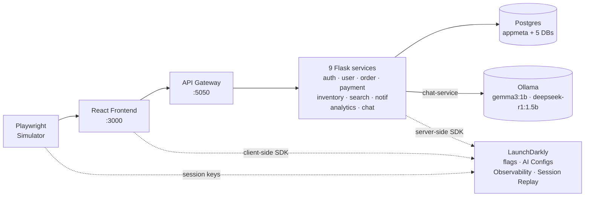

# LaunchDarkly Full-Stack Observability Populator

A proof-of-concept demo that emits realistic, opinionated observability data into LaunchDarkly: distributed traces, session replays, structured logs, OTel metrics, errors, flag evaluations, guarded-rollout candidates, and LLM telemetry from an AI-configured support chatbot. Meant for SEs and engineers who need a persistent firehose of LD signals to demo or prototype against.

## What you see when you run it

Spin it up and point it at an LD project; within a few minutes the dashboard populates with:

- **Distributed traces** spanning browser → API gateway → Flask services → Postgres → Ollama (LLM), W3C context propagation end-to-end.
- **Session replays** for every simulated user — with privacy level driven by `session-replay-privacy` flag, and linked to feedback events via `o11y_session_id`.
- **Funnel metrics** (search → cart → checkout_started → funnel_step → order_placed) tagged with the variant the user actually saw, so the 3×4 `product-card-layout` × `promo-banner` grid is sliceable for conversion analysis.
- **Flag-driven error injection** in `inventory-service` via `migrate-warehouse-api` (v1 stable / v2 ~93% errors / v3 clean). Flip to v2 and watch error rate, span statuses, and checkout failure jump together.
- **Guarded rollout candidates** via `payment-processor-migration` — DB pathologies (slow queries, planner regressions, pool holds, rollbacks) surface as span tree abnormalities when the flag moves to v2. Evaluated in the checkout flow (payment + order services) so sample volume is sufficient for rollout advancement.
- **LLM observability** — the `support-chatbot` AI Config selects model + prompt + hyperparameters at runtime; token usage, latency, TTFT, and thumbs feedback are attributed to the variation. LLM spans also appear in the trace timeline via OpenLLMetry.
- **Qualitative feedback** — `$ld:feedback` events with sentiment weighted by the errors the simulator encountered, biased toward the `migrate-warehouse-api` flag so you can demo feedback-driven investigations.

See [`SIGNALS.md`](./SIGNALS.md) for the exhaustive signal inventory.

## Architecture



## Prerequisites

- Docker + Docker Compose
- **A LaunchDarkly project you own** with **Observability** and **Session Replay** enabled. Note the project key, server-side SDK key, and client-side ID — you'll set them in `.env`. Nothing is shared; every contributor uses their own project.
- For LLM mode: either Ollama running natively (`brew install ollama`, recommended on Mac for GPU) or the `local-models` compose profile (CPU-only in Docker, slower).

## Quickstart

```bash
cp .env.example .env
# edit .env — set LD_SDK_KEY and VITE_LD_CLIENT_SIDE_ID
docker compose up -d --build
```

Frontend at http://localhost:3000, API gateway at http://localhost:5050.

For LLM-enabled chat, add `CHAT_ENABLED=true` and either:
- Point at native Ollama: `OLLAMA_URL=http://host.docker.internal:11434`, or
- Use the bundled container: `docker compose --profile local-models up -d --build`

For persistent AWS deployment (EC2, ECS, or shared LLM server), see [`INDIVIDUAL_AWS_DEPLOYMENT.md`](./INDIVIDUAL_AWS_DEPLOYMENT.md).

## Required LaunchDarkly resources

The app expects these keys in your LaunchDarkly project. Provision them with Terraform (see [`terraform/`](./terraform/) — you supply your project key, no default) or by hand in the LD UI.

| Resource | Key | Purpose |
|---|---|---|
| Flag | `migrate-warehouse-api` | Gates warehouse error injection in `inventory-service` |
| Flag | `payment-processor-migration` | Routes DB pathology scenarios in `payment-service`; evaluated in the checkout flow (payment + order services) for guarded-rollout sampling |
| Flag | `session-replay-privacy` | Fetched pre-SDK-init, passed to SessionReplay constructor |
| Flag | `product-card-layout` | Product card variant (standard / minimal / detailed); tagged on funnel metrics |
| Flag | `promo-banner` | Site-wide banner variant; tagged on funnel metrics |
| AI Config | `support-chatbot` | Model + system prompt + hyperparameters for the chatbot in `chat-service` |

Full mechanics of each flag (variations, defaults, where evaluated, what it gates) live in [`AGENTS.md`](./AGENTS.md).

## Versioning

`SERVICE_VERSION` in `.env` is the single source of truth. `docker-compose.yml` reads it for every backend service (`SERVICE_VERSION` env var) and as the frontend build arg (`VITE_SERVICE_VERSION`, baked into the bundle at build time and used by the Observability plugin). Bump it on substantive changes so rollouts and trace `service.version` stay coherent. Rebuild the frontend (`docker compose up -d --build frontend`) when you bump it — the version is baked into the JS bundle, not read at runtime.

## Contributing

**AI agents extending this repo: start with [`AGENTS.md`](./AGENTS.md).** It has the full flag table with file:line references, service topology, simulator internals, common pitfalls, and links to per-subsystem docs.

## License

MIT
