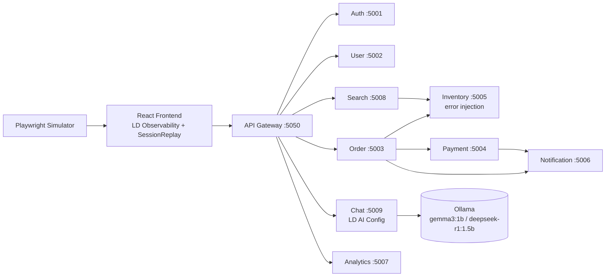

# Signals Overview

What this project emits into LaunchDarkly Observability — traces, metrics, logs, errors, session replays, LLM telemetry, and qualitative feedback — and how each signal ties back to feature flags.

---

## 1. Architecture & Trace Topology

Every arrow below represents a real HTTP call that propagates W3C `traceparent` / `tracestate` headers, so each user action produces a single distributed trace spanning browser → gateway → microservices → (optionally) Ollama.

Traces you should expect to see:
- **Product browse**: `Frontend → Gateway → Search → Inventory`
- **Checkout**: `Frontend → Gateway → Order → Inventory → Payment → Notification`
- **Chat**: `Frontend → Gateway → Chat → Ollama` (with LLM spans)

---

## 2. Where Flags Are Embedded

| Flag Key | Type | Embedded In | What It Controls |
|---|---|---|---|
| `product-card-layout` | Multivariate (standard / minimal / detailed) | `frontend/src/pages/Products.jsx`, `components/products/ProductCard.jsx`, `pages/Checkout.jsx` | Product card UI variant; tagged onto every cart/search/checkout metric as `layout_variant` |
| `promo-banner` | Multivariate (none / free-shipping-50 / percent-off / urgency) | `frontend/src/components/layout/PromoBanner.jsx` | Banner messaging + countdown; tagged on checkout-path metrics as `promo_variant` |
| `migrate-warehouse-api` | Multivariate (v1 / v2 / v3) | `backend/services/inventory-service/app.py` | Gates warehouse error injection — see §4 |
| `session-replay-privacy` | Multivariate (none / default / strict) | `frontend/src/main.jsx` | Fetched pre-SDK-init via clientsdk eval endpoint; passed to `SessionReplay` constructor |
| `support-chatbot` | **AI Config** | `backend/services/chat-service/app.py` | Selects LLM model + system prompt + hyperparameters — see §5 |

---

## 3. Metrics (and how they relate to the layout/promo flags)

Every funnel metric carries `layout_variant` (and, where applicable, `promo_variant`) as an attribute, so the product-card-layout × promo-banner cross-product can be sliced on any of them for conversion analysis.

### Frontend (LDObserve)

| Metric | Attributes | Emitted At |
|---|---|---|
| `app.search.submitted_total` | `layout_variant`, `had_results` | `pages/Products.jsx` |
| `app.search.result_count` | `layout_variant` | `pages/Products.jsx` |
| `app.cart.item_added_total` | `layout_variant`, `product_id`, `product_price` | `components/products/ProductCard.jsx` |
| `app.checkout.started_total` | `layout_variant`, `promo_variant` | `pages/Checkout.jsx` |
| `app.cart.size` | `layout_variant`, `promo_variant` | `pages/Checkout.jsx` |
| `app.cart.value_usd` | `layout_variant`, `promo_variant` | `pages/Checkout.jsx` |

### Backend (OTel via `shared/observability.py`)

| Metric | Attributes | Emitted At |
|---|---|---|
| `app.checkout.funnel_step_total` | `layout_variant`, `promo_variant`, `user_plan`, `step` (`reserve_inventory` / `process_payment`), `success` | `order-service` |
| `app.order.placed_total` | `layout_variant`, `promo_variant`, `user_plan`, `item_count` | `order-service` |
| `app.order.value_usd` | `layout_variant`, `promo_variant`, `user_plan` | `order-service` (histogram) |
| `app.inventory.warehouse_error_total` | `warehouse_api_version`, `error_type`, `endpoint` | `inventory-service` |

**The funnel story**: `search → cart → checkout_started → funnel_step → order_placed → order_value` — every step carries the flag variants, so you can build conversion rate, AOV, and drop-off charts sliced by the 3×4 variant grid.

---

## 4. Inventory Flag & Error Injection

`migrate-warehouse-api` (in `inventory-service/app.py`) gates a synthetic error scenario inside the warehouse API call:

| Variant | Composite Error Rate | Scenarios |
|---|---|---|
| **v1** (legacy) | ~1% baseline | Background errors only |
| **v2** (unstable) | **~93%** | Timeout 504 (28%, 3-8s latency) · ResponseParse 500 (24%) · RateLimit 429 (18%) · StaleCache 500 (14%) · Auth 503 (9%) |
| **v3** (stable) | 0% | Clean |

Each injected error:
1. Increments `app.inventory.warehouse_error_total` with `error_type` + `warehouse_api_version`
2. Calls `record_exception(err, {...})` → attaches exception + `ERROR` status to the current span
3. Emits a structured log via `record_log(..., LEVELS['error'], {...})`
4. Bubbles up through `order-service` → `app.checkout.funnel_step_total{success=false}`

So flipping `migrate-warehouse-api` v1→v2 should visibly degrade error rate, latency, span error counts, and downstream checkout success in parallel.

---

## 5. Chatbot & LLM Observability

`chat-service` (port 5009) calls a local Ollama server. LLM telemetry comes from three layers:

**1. Auto-instrumentation** — `OllamaInstrumentor().instrument()` (OpenLLMetry) auto-captures every `ollama.chat()` call as an OTel LLM span.

**2. Manual span attributes** set per request:
- `llm.model`, `gen_ai.request.model`, `gen_ai.response.model`
- `llm.input_tokens`, `llm.output_tokens`, `gen_ai.usage.{input,output}_tokens`
- `llm.duration_ms`, `gen_ai.operation.name="chat"`, `gen_ai.system="ollama"`

**3. LD AI Config tracker** (`support-chatbot` AI Config):
- `ai_client.completion_config(...)` returns `ModelConfig` + system messages + tracker
- `tracker.track_tokens(TokenUsage(...))`
- `tracker.track_duration(duration_ms)`
- `tracker.track_time_to_first_token(ttft_ms)` — computed from Ollama's `load_duration` + `prompt_eval_duration`
- `tracker.track_feedback({kind: Positive|Negative})` on thumbs up/down (see §6)

Trackers are cached by `generation_id` (LRU ~500 entries) so feedback can be attributed back to the specific variation that produced the response.

---

## 6. Qualitative Feedback

Two separate feedback channels:

**a) Site feedback widget** (`frontend/src/components/FeedbackWidget.jsx`)
- Floating button, 3-sentiment buttons + text area
- Emits via `ldClient.track('$ld:feedback', {...})` with:
  - `sentiment`: positive / neutral / negative
  - `flag_key`: random pick from a curated list (includes `migrate-warehouse-api`)
  - `feedback_answer`: user text
  - `o11y_session_id`: pulled from `LDRecord.getSession().sessionSecureID` so feedback links to a replay
- Exposes `window.__submitFeedback(flagKey, sentiment, text)` for simulator to drive

**b) Chat thumbs up/down** (`ChatWidget.jsx` → `/api/chat/feedback`)
- POST with `{generation_id, sentiment}`
- Backend looks up the cached AI Config tracker and calls `tracker.track_feedback(...)` — attributes the rating to the specific AI Config variation that generated the response

---

## 7. Other Signals You Might Have Forgotten

- **Structured logs** — `record_log(...)` on backend, `LDObserve.recordLog(...)` on frontend. All logs include service, endpoint, method, user, and relevant flag values.
- **Exceptions** — `record_exception(...)` (backend) and `LDObserve.recordError(...)` (frontend + ErrorBoundary + Router error boundary). An `errorInjection.js` util can also synthesize JS errors on demand.
- **Session Replay** — `@launchdarkly/session-replay` 0.4.7, `inlineStylesheet: true`, privacy driven by `session-replay-privacy`. Session ID linkable via `LDRecord.getSession().sessionSecureID` (attached to feedback events).
- **Network recording** — Observability plugin runs with `networkRecording.enabled = true` and `recordHeadersAndBody = true`, so every XHR/fetch (including bodies) is captured and linkable to spans.
- **Distributed trace propagation** — all backend services forward `traceparent` / `tracestate` via `get_trace_headers()`, so the browser span, gateway span, and downstream microservice spans stitch into one trace.
- **Service health** — every service exposes `/health`; `chat-service` additionally reports `ollama_connected`. Useful for demoing uptime/availability panels.
- **Simulator-driven session keys** — `simulator/traffic_generator.py` writes every session key to `/app/logs/session_keys.log`. Cross-reference these against LD dashboards when you need to point at a specific simulated user's journey.
- **Weighted simulator feedback** — the simulator biases feedback sentiment based on whether it hit errors during the session, so `$ld:feedback` correlates with `migrate-warehouse-api` variants for free.

---

## TL;DR — What You Can Demo

1. **Funnel analysis sliced by the 3×4 flag grid** — every funnel metric carries `layout_variant` + `promo_variant`.
2. **Error-rate / latency / conversion correlation** — flip `migrate-warehouse-api` to v2 and watch errors, span statuses, and `funnel_step_total{success=false}` all move together.
3. **LLM cost/quality tracking** — token usage, TTFT, duration, and thumbs-rating all attributed to the `support-chatbot` AI Config variation.
4. **Session replay → feedback linkage** — the `$ld:feedback` event carries `o11y_session_id` so you can jump from a thumbs-down directly to the replay.
5. **Full-stack distributed traces** — browser span ties through to Ollama LLM span on a single trace for chat; through to inventory/payment/notification for checkout.
