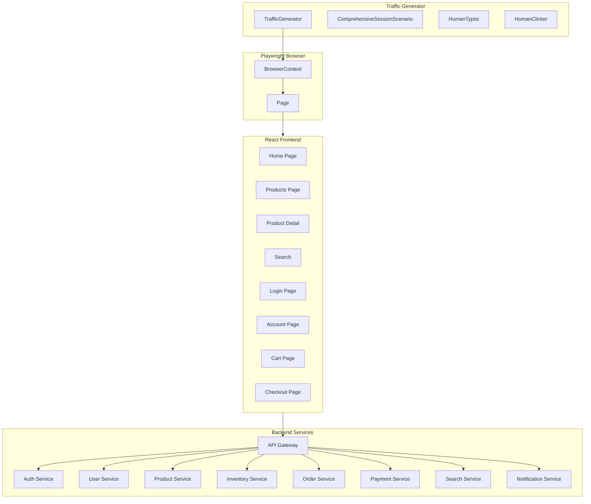
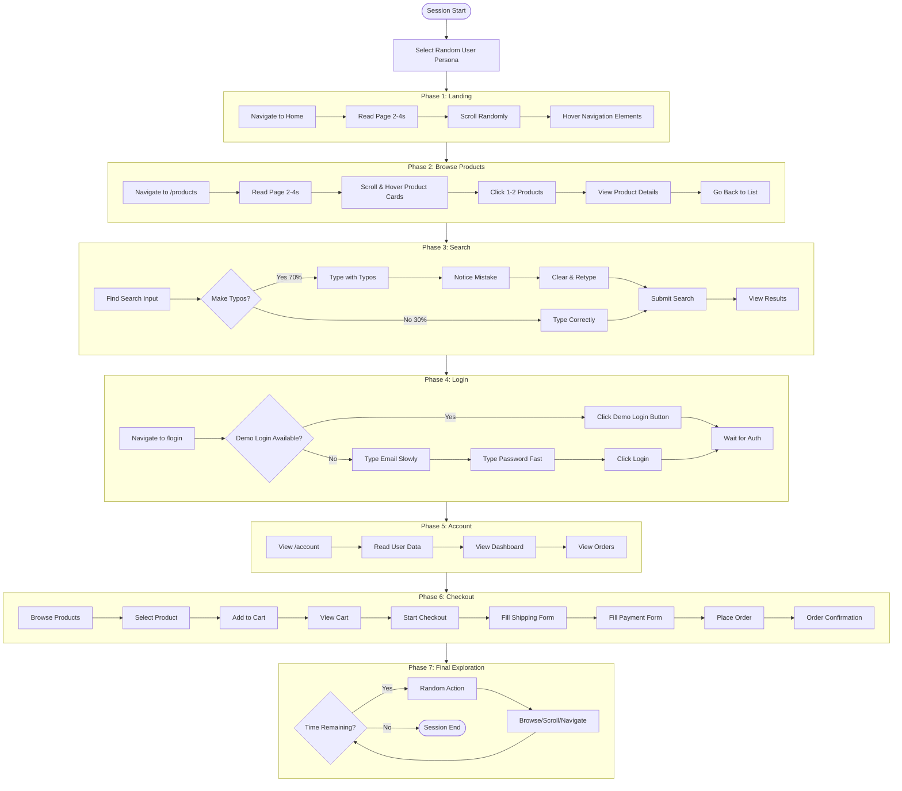
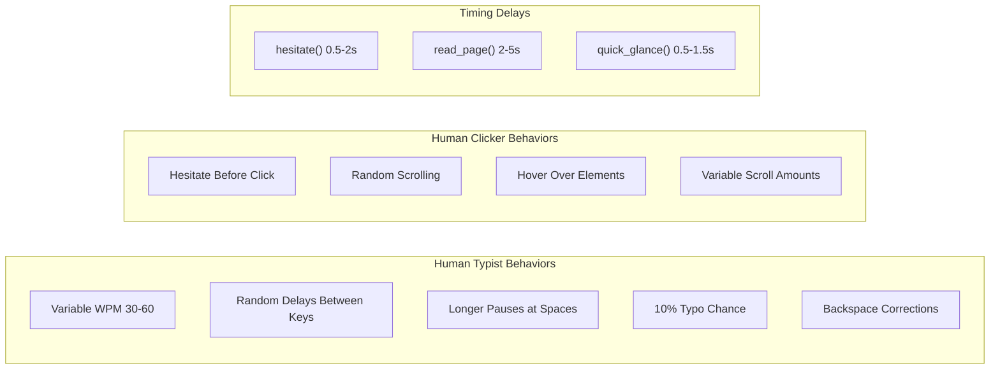
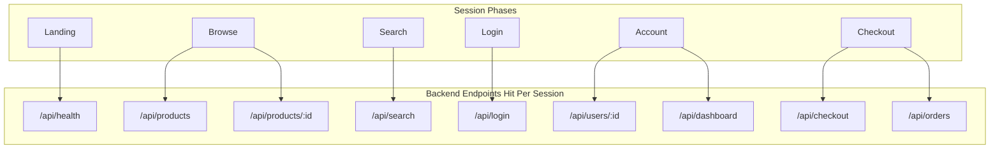
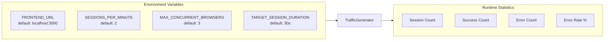
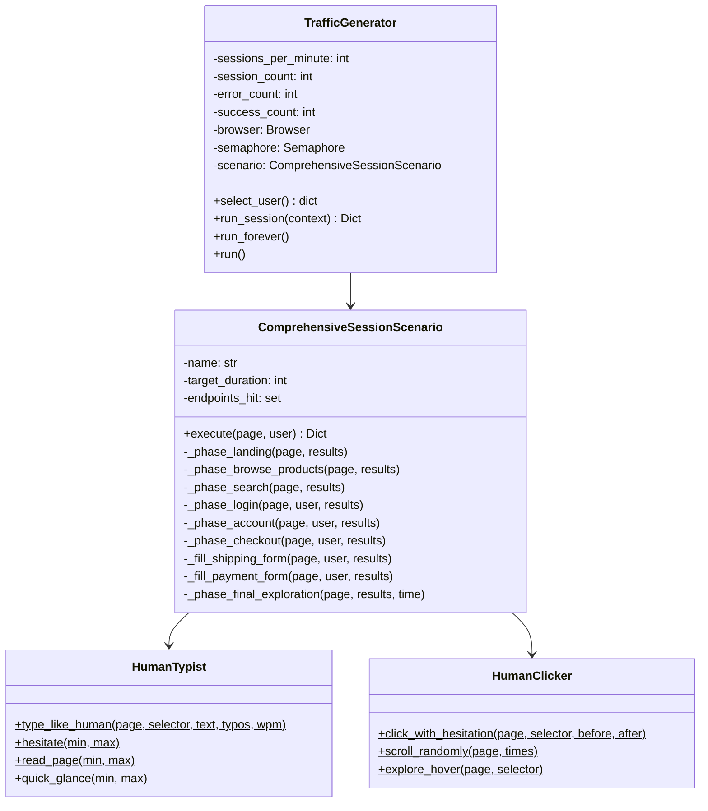
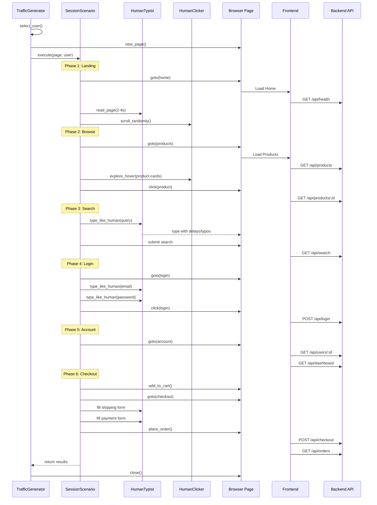

# Traffic Simulator Architecture

This document describes the architecture and flow of the LaunchDarkly Observability Demo traffic simulator.

## High-Level Architecture

## Session Flow

Each simulated session follows this comprehensive flow to hit all backend endpoints:

## Human-Like Behaviors

The simulator implements realistic human behaviors:

## API Endpoints Coverage

Each session is designed to hit all major backend endpoints:

## Configuration

## Class Diagram

## Sequence Diagram - Single Session

