# Traffic Simulator Architecture

This document describes the architecture and flow of the LaunchDarkly Observability Demo traffic simulator.

## High-Level Architecture

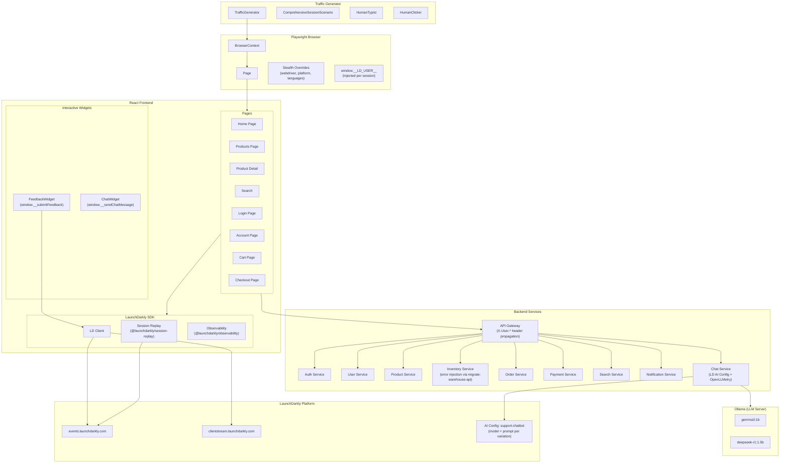
```mermaid
flowchart TB
    subgraph Simulator["Traffic Generator"]
        TG[TrafficGenerator]
        CSS[ComprehensiveSessionScenario]
        HT[HumanTypist]
        HC[HumanClicker]
    end

    subgraph Browser["Playwright Browser"]
        BC[BrowserContext]
        P[Page]
        Stealth["Stealth Overrides<br/>(webdriver, platform, languages)"]
        LDUser["window.__LD_USER__<br/>(injected per session)"]
    end

    subgraph Frontend["React Frontend"]
        subgraph Pages["Pages"]
            Home[Home Page]
            Products[Products Page]
            ProductDetail[Product Detail]
            Search[Search]
            Login[Login Page]
            Account[Account Page]
            Cart[Cart Page]
            Checkout[Checkout Page]
        end
        subgraph Widgets["Interactive Widgets"]
            FeedbackWidget["FeedbackWidget<br/>(window.__submitFeedback)"]
            ChatWidget["ChatWidget<br/>(window.__sendChatMessage)"]
        end
        subgraph LDSDK["LaunchDarkly SDK"]
            LDClient[LD Client]
            SessionReplay["Session Replay<br/>(@launchdarkly/session-replay)"]
            Observability["Observability<br/>(@launchdarkly/observability)"]
        end
    end

    subgraph Backend["Backend Services"]
        API["API Gateway<br/>(X-User-* header propagation)"]
        Auth[Auth Service]
        User[User Service]
        Prod[Product Service]
        Inv["Inventory Service<br/>(error injection via migrate-warehouse-api)"]
        Order[Order Service]
        Pay[Payment Service]
        SearchSvc[Search Service]
        Notif[Notification Service]
        ChatSvc["Chat Service<br/>(LD AI Config + OpenLLMetry)"]
    end

    subgraph LLM["Ollama (LLM Server)"]
        Gemma["gemma3:1b"]
        DeepSeek["deepseek-r1:1.5b"]
    end

    subgraph LD["LaunchDarkly Platform"]
        LDEvents[events.launchdarkly.com]
        LDStream[clientstream.launchdarkly.com]
        LDAIConfig["AI Config: support-chatbot<br/>(model + prompt per variation)"]
    end

    TG --> BC
    BC --> P
    P --> Pages
    Pages --> LDSDK
    Pages --> API
    API --> Auth
    API --> User
    API --> Prod
    API --> Inv
    API --> Order
    API --> Pay
    API --> SearchSvc
    API --> Notif
    API --> ChatSvc
    ChatSvc --> LLM
    ChatSvc --> LDAIConfig
    LDClient --> LDEvents
    LDClient --> LDStream
    SessionReplay --> LDEvents
    FeedbackWidget --> LDClient
```

## Session Flow

Each simulated session follows this comprehensive flow to hit all backend endpoints:

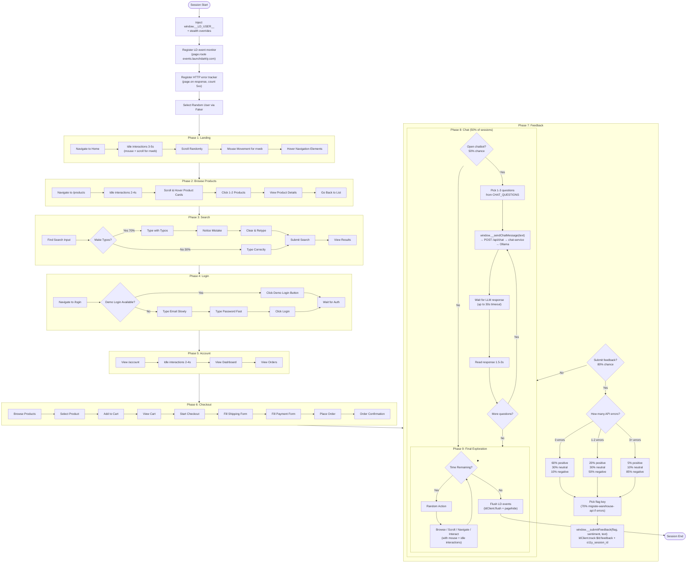
```mermaid
flowchart TD
    Start([Session Start]) --> Inject["Inject window.__LD_USER__<br/>+ stealth overrides"]
    Inject --> Monitor["Register LD event monitor<br/>(page.route events.launchdarkly.com)"]
    Monitor --> ErrorTrack["Register HTTP error tracker<br/>(page.on response, count 5xx)"]
    ErrorTrack --> SelectUser[Select Random User via Faker]
    SelectUser --> Phase1

    subgraph Phase1["Phase 1: Landing"]
        P1A[Navigate to Home] --> P1B["Idle interactions 3-5s<br/>(mouse + scroll for rrweb)"]
        P1B --> P1C[Scroll Randomly]
        P1C --> P1D[Mouse Movement for rrweb]
        P1D --> P1E[Hover Navigation Elements]
    end

    Phase1 --> Phase2

    subgraph Phase2["Phase 2: Browse Products"]
        P2A[Navigate to /products] --> P2B["Idle interactions 2-4s"]
        P2B --> P2C[Scroll & Hover Product Cards]
        P2C --> P2D[Click 1-2 Products]
        P2D --> P2E[View Product Details]
        P2E --> P2F[Go Back to List]
    end

    Phase2 --> Phase3

    subgraph Phase3["Phase 3: Search"]
        P3A[Find Search Input] --> P3B{Make Typos?}
        P3B -->|Yes 70%| P3C[Type with Typos]
        P3B -->|No 30%| P3D[Type Correctly]
        P3C --> P3E[Notice Mistake]
        P3E --> P3F[Clear & Retype]
        P3F --> P3G[Submit Search]
        P3D --> P3G
        P3G --> P3H[View Results]
    end

    Phase3 --> Phase4

    subgraph Phase4["Phase 4: Login"]
        P4A[Navigate to /login] --> P4B{Demo Login Available?}
        P4B -->|Yes| P4C[Click Demo Login Button]
        P4B -->|No| P4D[Type Email Slowly]
        P4D --> P4E[Type Password Fast]
        P4E --> P4F[Click Login]
        P4C --> P4G[Wait for Auth]
        P4F --> P4G
    end

    Phase4 --> Phase5

    subgraph Phase5["Phase 5: Account"]
        P5A[View /account] --> P5B["Idle interactions 2-4s"]
        P5B --> P5C[View Dashboard]
        P5C --> P5D[View Orders]
    end

    Phase5 --> Phase6

    subgraph Phase6["Phase 6: Checkout"]
        P6A[Browse Products] --> P6B[Select Product]
        P6B --> P6C[Add to Cart]
        P6C --> P6D[View Cart]
        P6D --> P6E[Start Checkout]
        P6E --> P6F[Fill Shipping Form]
        P6F --> P6G[Fill Payment Form]
        P6G --> P6H[Place Order]
        P6H --> P6I[Order Confirmation]
    end

    Phase6 --> Phase7

    subgraph Phase7["Phase 7: Feedback"]
        P7A{Submit feedback?<br/>80% chance} -->|No| Phase8
        P7A -->|Yes| P7B{How many API errors?}
        P7B -->|0 errors| P7C["60% positive<br/>30% neutral<br/>10% negative"]
        P7B -->|1-2 errors| P7D["20% positive<br/>30% neutral<br/>50% negative"]
        P7B -->|3+ errors| P7E["5% positive<br/>10% neutral<br/>85% negative"]
        P7C --> P7F["Pick flag key<br/>(70% migrate-warehouse-api if errors)"]
        P7D --> P7F
        P7E --> P7F
        P7F --> P7G["window.__submitFeedback(flag, sentiment, text)<br/>ldClient.track $ld:feedback + o11y_session_id"]
    end

    Phase7 --> Phase8

    subgraph Phase8["Phase 8: Chat (50% of sessions)"]
        P8A{Open chatbot?<br/>50% chance} -->|No| Phase9
        P8A -->|Yes| P8B["Pick 1-3 questions<br/>from CHAT_QUESTIONS"]
        P8B --> P8C["window.__sendChatMessage(text)<br/>→ POST /api/chat → chat-service → Ollama"]
        P8C --> P8D["Wait for LLM response<br/>(up to 30s timeout)"]
        P8D --> P8E["Read response 1.5-3s"]
        P8E --> P8F{More questions?}
        P8F -->|Yes| P8C
        P8F -->|No| Phase9
    end

    Phase8 --> Phase9

    subgraph Phase9["Phase 9: Final Exploration"]
        P9A{Time Remaining?}
        P9A -->|Yes| P9B[Random Action]
        P9B --> P9C["Browse / Scroll / Navigate / Interact<br/>(with mouse + idle interactions)"]
        P9C --> P9A
        P9A -->|No| Flush
    end

    Flush["Flush LD events<br/>(ldClient.flush + pagehide)"] --> End([Session End])
```

## Human-Like Behaviors

The simulator implements realistic human behaviors:

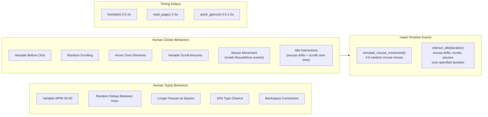
```mermaid
flowchart LR
    subgraph HumanTypist["Human Typist Behaviors"]
        T1[Variable WPM 30-60]
        T2[Random Delays Between Keys]
        T3[Longer Pauses at Spaces]
        T4[10% Typo Chance]
        T5[Backspace Corrections]
    end

    subgraph HumanClicker["Human Clicker Behaviors"]
        C1[Hesitate Before Click]
        C2[Random Scrolling]
        C3[Hover Over Elements]
        C4[Variable Scroll Amounts]
        C5["Mouse Movement<br/>(rrweb MouseMove events)"]
        C6["Idle Interactions<br/>(mouse drifts + scrolls over time)"]
    end

    subgraph Timing["Timing Delays"]
        D1["hesitate() 0.5-2s"]
        D2["read_page() 2-5s"]
        D3["quick_glance() 0.5-1.5s"]
    end

    subgraph RRWeb["rrweb Timeline Events"]
        R1["simulate_mouse_movement()<br/>3-6 random mouse moves"]
        R2["interact_idle(duration)<br/>mouse drifts, scrolls, pauses<br/>over specified duration"]
    end

    HumanClicker --> RRWeb
```

## API Endpoints Coverage

Each session is designed to hit all major backend endpoints:

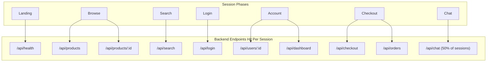
```mermaid
flowchart TB
    subgraph Endpoints["Backend Endpoints Hit Per Session"]
        E1["/api/health"]
        E2["/api/dashboard"]
        E3["/api/login"]
        E4["/api/users/:id"]
        E5["/api/products"]
        E6["/api/products/:id"]
        E7["/api/search"]
        E8["/api/checkout"]
        E9["/api/orders"]
        E10["/api/chat (50% of sessions)"]
    end

    subgraph Phases["Session Phases"]
        Landing --> E1
        Browse --> E5
        Browse --> E6
        Search --> E7
        Login --> E3
        Account --> E4
        Account --> E2
        Checkout --> E8
        Checkout --> E9
        Chat --> E10
    end
```

## User Context Flow

User identity is propagated end-to-end from the simulator through the frontend to all backend services:

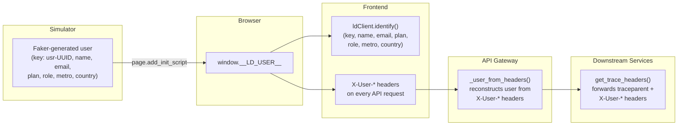
```mermaid
flowchart LR
    subgraph Simulator
        Faker["Faker-generated user<br/>(key: usr-UUID, name, email,<br/>plan, role, metro, country)"]
    end

    subgraph Browser
        LDUser["window.__LD_USER__"]
    end

    subgraph Frontend
        LDIdentify["ldClient.identify()<br/>(key, name, email, plan,<br/>role, metro, country)"]
        APIHeaders["X-User-* headers<br/>on every API request"]
    end

    subgraph APIGateway["API Gateway"]
        UserFromHeaders["_user_from_headers()<br/>reconstructs user from<br/>X-User-* headers"]
    end

    subgraph Services["Downstream Services"]
        TraceHeaders["get_trace_headers()<br/>forwards traceparent +<br/>X-User-* headers"]
    end

    Faker -->|"page.add_init_script"| LDUser
    LDUser --> LDIdentify
    LDUser --> APIHeaders
    APIHeaders --> UserFromHeaders
    UserFromHeaders --> TraceHeaders
```

## Configuration

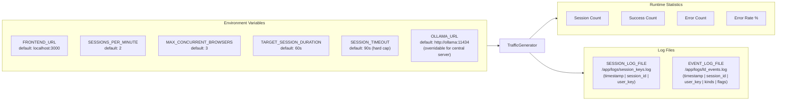
```mermaid
flowchart LR
    subgraph Config["Environment Variables"]
        C1["FRONTEND_URL<br/>default: localhost:3000"]
        C2["SESSIONS_PER_MINUTE<br/>default: 2"]
        C3["MAX_CONCURRENT_BROWSERS<br/>default: 3"]
        C4["TARGET_SESSION_DURATION<br/>default: 60s"]
        C5["SESSION_TIMEOUT<br/>default: 90s (hard cap)"]
        C6["OLLAMA_URL<br/>default: http://ollama:11434<br/>(overridable for central server)"]
    end

    subgraph Logs["Log Files"]
        L1["SESSION_LOG_FILE<br/>/app/logs/session_keys.log<br/>(timestamp | session_id | user_key)"]
        L2["EVENT_LOG_FILE<br/>/app/logs/ld_events.log<br/>(timestamp | session_id | user_key | kinds | flags)"]
    end

    subgraph Stats["Runtime Statistics"]
        S1[Session Count]
        S2[Success Count]
        S3[Error Count]
        S4[Error Rate %]
    end

    Config --> Generator[TrafficGenerator]
    Generator --> Stats
    Generator --> Logs
```

## Class Diagram

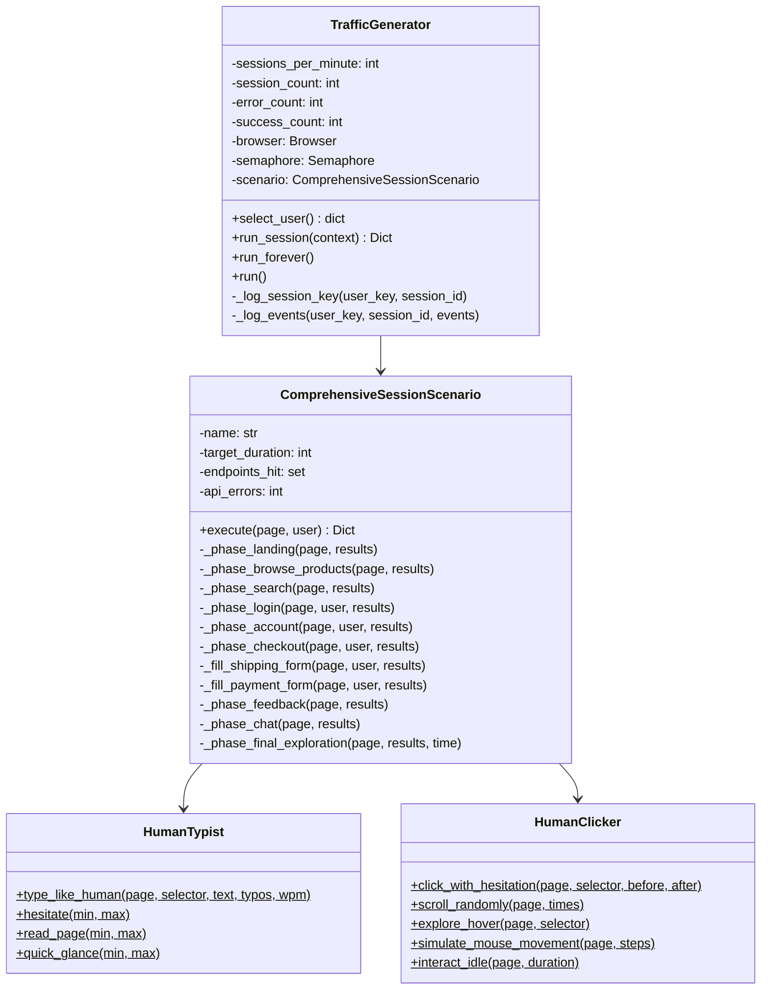
```mermaid
classDiagram
    class TrafficGenerator {
        -sessions_per_minute: int
        -session_count: int
        -error_count: int
        -success_count: int
        -browser: Browser
        -semaphore: Semaphore
        -scenario: ComprehensiveSessionScenario
        +select_user() dict
        +run_session(context) Dict
        +run_forever()
        +run()
        -_log_session_key(user_key, session_id)
        -_log_events(user_key, session_id, events)
    }

    class ComprehensiveSessionScenario {
        -name: str
        -target_duration: int
        -endpoints_hit: set
        -api_errors: int
        +execute(page, user) Dict
        -_phase_landing(page, results)
        -_phase_browse_products(page, results)
        -_phase_search(page, results)
        -_phase_login(page, user, results)
        -_phase_account(page, user, results)
        -_phase_checkout(page, user, results)
        -_fill_shipping_form(page, user, results)
        -_fill_payment_form(page, user, results)
        -_phase_feedback(page, results)
        -_phase_chat(page, results)
        -_phase_final_exploration(page, results, time)
    }

    class HumanTypist {
        +type_like_human(page, selector, text, typos, wpm)$
        +hesitate(min, max)$
        +read_page(min, max)$
        +quick_glance(min, max)$
    }

    class HumanClicker {
        +click_with_hesitation(page, selector, before, after)$
        +scroll_randomly(page, times)$
        +explore_hover(page, selector)$
        +simulate_mouse_movement(page, steps)$
        +interact_idle(page, duration)$
    }

    TrafficGenerator --> ComprehensiveSessionScenario
    ComprehensiveSessionScenario --> HumanTypist
    ComprehensiveSessionScenario --> HumanClicker
```

## Sequence Diagram - Single Session

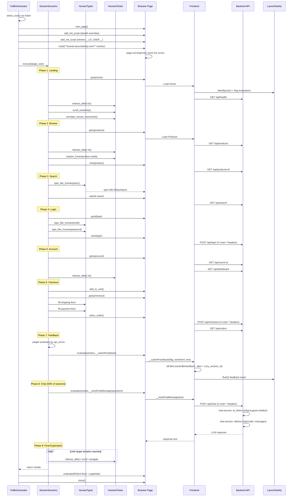
```mermaid
sequenceDiagram
    participant TG as TrafficGenerator
    participant CSS as SessionScenario
    participant HT as HumanTypist
    participant HC as HumanClicker
    participant Page as Browser Page
    participant FE as Frontend
    participant BE as Backend API
    participant LD as LaunchDarkly

    TG->>TG: select_user() via Faker
    TG->>Page: new_page()
    TG->>Page: add_init_script (stealth overrides)
    TG->>Page: add_init_script (window.__LD_USER__)
    TG->>Page: route(**/events.launchdarkly.com/** monitor)
    Page->>Page: page.on('response') track 5xx errors

    TG->>CSS: execute(page, user)

    Note over CSS: Phase 1: Landing
    CSS->>Page: goto(home)
    Page->>FE: Load Home
    FE->>LD: identify(user) + flag evaluations
    FE->>BE: GET /api/health
    CSS->>HC: interact_idle(3-5s)
    CSS->>HC: scroll_randomly()
    CSS->>HC: simulate_mouse_movement()

    Note over CSS: Phase 2: Browse
    CSS->>Page: goto(products)
    Page->>FE: Load Products
    FE->>BE: GET /api/products
    CSS->>HC: interact_idle(2-4s)
    CSS->>HC: explore_hover(product-cards)
    CSS->>Page: click(product)
    FE->>BE: GET /api/products/:id

    Note over CSS: Phase 3: Search
    CSS->>HT: type_like_human(query)
    HT-->>Page: type with delays/typos
    CSS->>Page: submit search
    FE->>BE: GET /api/search

    Note over CSS: Phase 4: Login
    CSS->>Page: goto(login)
    CSS->>HT: type_like_human(email)
    CSS->>HT: type_like_human(password)
    CSS->>Page: click(login)
    FE->>BE: POST /api/login (X-User-* headers)

    Note over CSS: Phase 5: Account
    CSS->>Page: goto(account)
    FE->>BE: GET /api/users/:id
    FE->>BE: GET /api/dashboard
    CSS->>HC: interact_idle(2-4s)

    Note over CSS: Phase 6: Checkout
    CSS->>Page: add_to_cart()
    CSS->>Page: goto(checkout)
    CSS->>HT: fill shipping form
    CSS->>HT: fill payment form
    CSS->>Page: place_order()
    FE->>BE: POST /api/checkout (X-User-* headers)
    FE->>BE: GET /api/orders

    Note over CSS: Phase 7: Feedback
    CSS->>CSS: weight sentiment by api_errors
    CSS->>Page: evaluate(window.__submitFeedback)
    Page->>FE: __submitFeedback(flag, sentiment, text)
    FE->>FE: ldClient.track('$ld:feedback', data + o11y_session_id)
    FE->>LD: flush() feedback event

    Note over CSS: Phase 8: Chat (50% of sessions)
    CSS->>Page: evaluate(window.__sendChatMessage(question))
    Page->>FE: __sendChatMessage(text)
    FE->>BE: POST /api/chat (X-User-* headers)
    BE->>BE: chat-service: ai_client.config('support-chatbot')
    BE->>BE: chat-service: ollama.chat(model, messages)
    BE-->>FE: LLM response
    FE-->>Page: response text

    Note over CSS: Phase 9: Final Exploration
    loop Until target duration reached
        CSS->>HC: interact_idle() / scroll / navigate
    end

    CSS-->>TG: return results
    TG->>Page: evaluate(ldClient.flush + pagehide)
    TG->>Page: close()
```

## AI Support Chatbot (LLM via Ollama + LD AI Configs)

The chat-service uses **two layers of observability**:

1. **LD AI SDK tracker** — records per-request metrics (token usage, latency, success/error) tied to the AI Config variation → visible in **AI Configs → Monitoring**
2. **OpenLLMetry auto-instrumentation** — captures LLM spans (model, prompts, responses, tokens, duration) as OpenTelemetry traces → visible in **Observability → Traces** with the green LLM badge

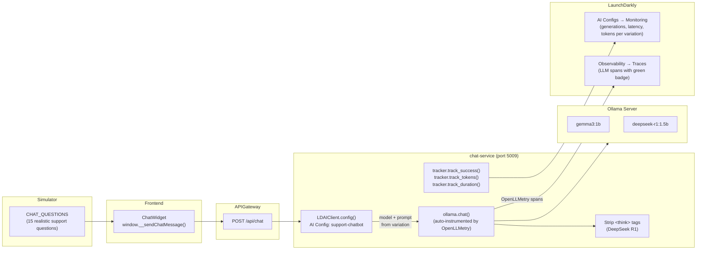
```mermaid
flowchart LR
    subgraph Simulator
        Question["CHAT_QUESTIONS<br/>(15 realistic support questions)"]
    end

    subgraph Frontend
        CW["ChatWidget<br/>window.__sendChatMessage()"]
    end

    subgraph APIGateway
        ChatRoute["POST /api/chat"]
    end

    subgraph ChatService["chat-service (port 5009)"]
        AIConfig["LDAIClient.config()<br/>AI Config: support-chatbot"]
        OllamaCall["ollama.chat()<br/>(auto-instrumented by OpenLLMetry)"]
        Tracker["tracker.track_success()<br/>tracker.track_tokens()<br/>tracker.track_duration()"]
        StripThink["Strip &lt;think&gt; tags<br/>(DeepSeek R1)"]
    end

    subgraph Ollama["Ollama Server"]
        Gemma["gemma3:1b"]
        DeepSeek["deepseek-r1:1.5b"]
    end

    subgraph LDPlatform["LaunchDarkly"]
        AIConfigDash["AI Configs → Monitoring<br/>(generations, latency, tokens per variation)"]
        Traces["Observability → Traces<br/>(LLM spans with green badge)"]
    end

    Question --> CW
    CW --> ChatRoute
    ChatRoute --> AIConfig
    AIConfig -->|"model + prompt<br/>from variation"| OllamaCall
    OllamaCall --> Ollama
    OllamaCall --> StripThink
    Tracker --> AIConfigDash
    OllamaCall -->|"OpenLLMetry spans"| Traces
```

### Deployment Modes

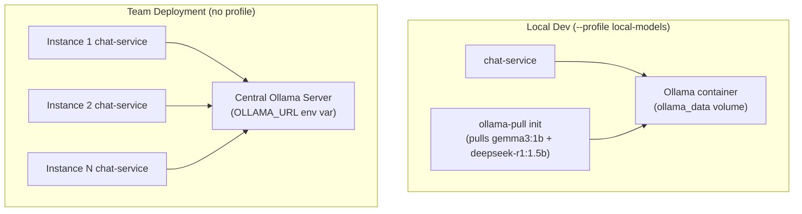
```mermaid
flowchart TB
    subgraph Local["Local Dev (--profile local-models)"]
        CS1["chat-service"] --> OL1["Ollama container<br/>(ollama_data volume)"]
        Init["ollama-pull init<br/>(pulls gemma3:1b + deepseek-r1:1.5b)"] --> OL1
    end

    subgraph Team["Team Deployment (no profile)"]
        CS2["Instance 1 chat-service"] --> Central["Central Ollama Server<br/>(OLLAMA_URL env var)"]
        CS3["Instance 2 chat-service"] --> Central
        CS4["Instance N chat-service"] --> Central
    end
```

## Error Injection

The `inventory-service` injects errors based on the `migrate-warehouse-api` flag variation:

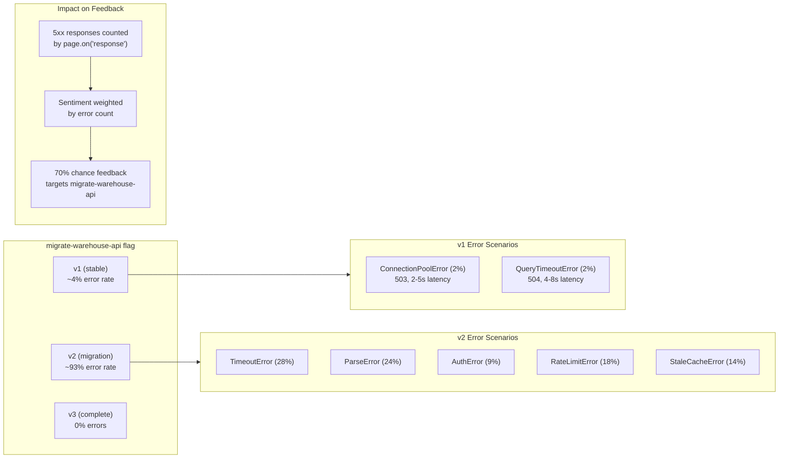
```mermaid
flowchart LR
    subgraph Flag["migrate-warehouse-api flag"]
        V1["v1 (stable)<br/>~4% error rate"]
        V2["v2 (migration)<br/>~93% error rate"]
        V3["v3 (complete)<br/>0% errors"]
    end

    subgraph V1Errors["v1 Error Scenarios"]
        V1E1["ConnectionPoolError (2%)<br/>503, 2-5s latency"]
        V1E2["QueryTimeoutError (2%)<br/>504, 4-8s latency"]
    end

    subgraph V2Errors["v2 Error Scenarios"]
        V2E1["TimeoutError (28%)"]
        V2E2["ParseError (24%)"]
        V2E3["AuthError (9%)"]
        V2E4["RateLimitError (18%)"]
        V2E5["StaleCacheError (14%)"]
    end

    V1 --> V1Errors
    V2 --> V2Errors

    subgraph FeedbackImpact["Impact on Feedback"]
        Errors["5xx responses counted<br/>by page.on('response')"] --> Sentiment["Sentiment weighted<br/>by error count"]
        Sentiment --> FlagBias["70% chance feedback<br/>targets migrate-warehouse-api"]
    end
```
